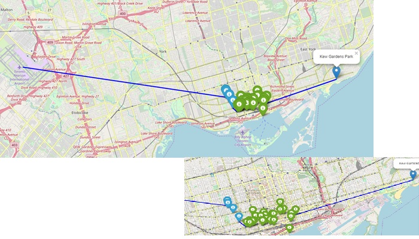

# Applied Data Science Week 5 - Capstone

## Business Problem Statement

Governments of United States of America and Canada have planned a meeting between their leaders. The precise day is not yet decided but an early agenda has been negociated: President Trump will land in Toronto Pearson International Airport at 11:30am and use a limo to cross over Toronto city from west to east in order to join Prime Minister Trudeau near Kew Gardens park, on the other side of the city. At the request of White House staff, the last detail to be decided is the path from the airport to the park.
Since President Trump will travel across Toronto at lunch time, it is likely that he will get hungry and decide to stop for a bite before reaching the final destination. President secretary knows that when the President get too much hungry he can come angry which would endanger the negotiation. As a result, President’s staff asked Canada authorities to provide a path from the airport to the park that will maximize the proximity with favorite President dishes: pizzas and hamburgers. It is very important that, all along the crossing of Toronto, President should be able to hit quickly so he is in the best state-of-mind for the discussions. This is crucial  for both Governments of United States of America and Canada.
White House staff expects overhall directions to cross from the airport to the park with a map of selected restaurants along the road.
The confidential audience of this study is the bureau of Government of Canada and Secret Services of United states of America.

### Data

This use case should leverage two data sources:
- Foursquare APIs will be used to retrieve the coordinates of all Italian and Fast Food restaurants in the city of Totonto (Foursaure API alllows a search for specific restaurant types). More specifically, the geo-spacial features returned by the API will be used to cluster the zones where there is the higher density of the restaurant. The cluster algorithm will be a density based algorithm using the Euclidian distance between restaurants as main cluster factor. This will allow to create better shappes for the clusters than circles.
-Toronto postal code coordinates (from Wikipeadia page) that will be used to create the end to end path. We will calculate the closer postal code area center to the edges (east and west) and centers of clustered areas. This will be bease to provided itinerary.

### Methodology

In order to find the best pa
- using Foursquare API, we have extracted all the different restaurants matching President's criteria.
- the lists of restaurant has been cleaned (removing duplicates entries and selecting only restaurants in the city) and merged into a unique dataset
- a density based cluster algorithm (https://en.wikipedia.org/wiki/DBSCAN) has been used to find the Toronto areas hosting a high density of pizza and burger restaurants. The algorith hyperparameters has been optimized in order to reduce the number of outliers.
- optimal clusters to cross has been selected
- a map with directions has been provided

### Results

The study has found that the optimal path between airport to park would cross 2 restaurant high desity zones, both placed at the south of Toronto University.

### Discussion
1. Optimizing data collection
The maximum venues collected with a Foursquare API is 50 which was reached on every call we made. When searching venues in a large area this may limit the scope of the search too much. One approach when looking more comprehensive results would be to scan subparts of the area and merge all results together.

2. Optimizing algorithm hyperparameters
One of the finding of this study was the difficulty to set the two main hyperparameters of DBSCAN algorithm:
- the maximum distance between 2 entries
- mininum number of points to create a cluster
Depending on the business objectives, different values can be used providing different numner of clusters and shapes of clusters.
For this study, we have decided to use the combination of hyperparameters that minimize the number of outliers.

3. Optimizing clsutering using ratings
One idea not explored is to include on cluster features, the rating of each restaurant as input to DBSCAN so each cluster would have specific characteristics for location and expected qualidy

4. Generalization of the approach
This study can be reused to accomadate travel paths across "opportunities" zones: the path is built to go where something is more likely to be found or is more likely to append. For example, when you go over a national park and you want to maximize the chance to face wild animals.

### Conclusion
The study has found that the optimal path between airport to park would cross 2 restaurant high desity zones, both placed at the south of Toronto University.
The general direction is reprensented by arrows in the map bellow:
